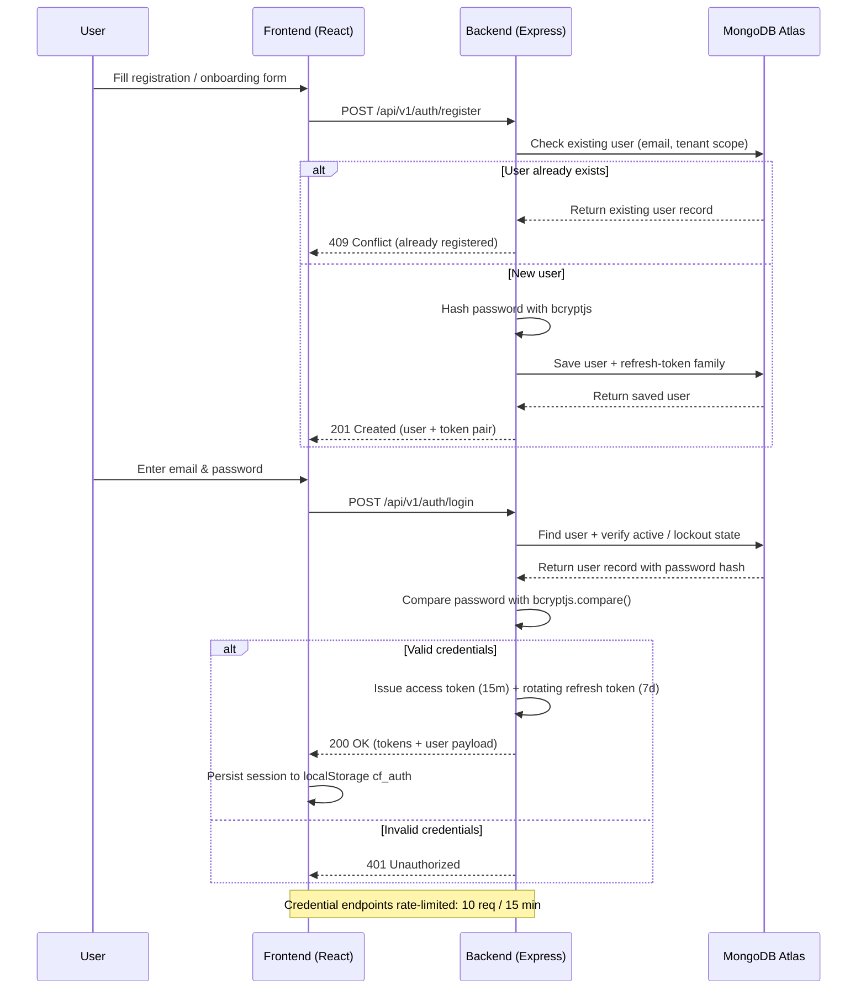
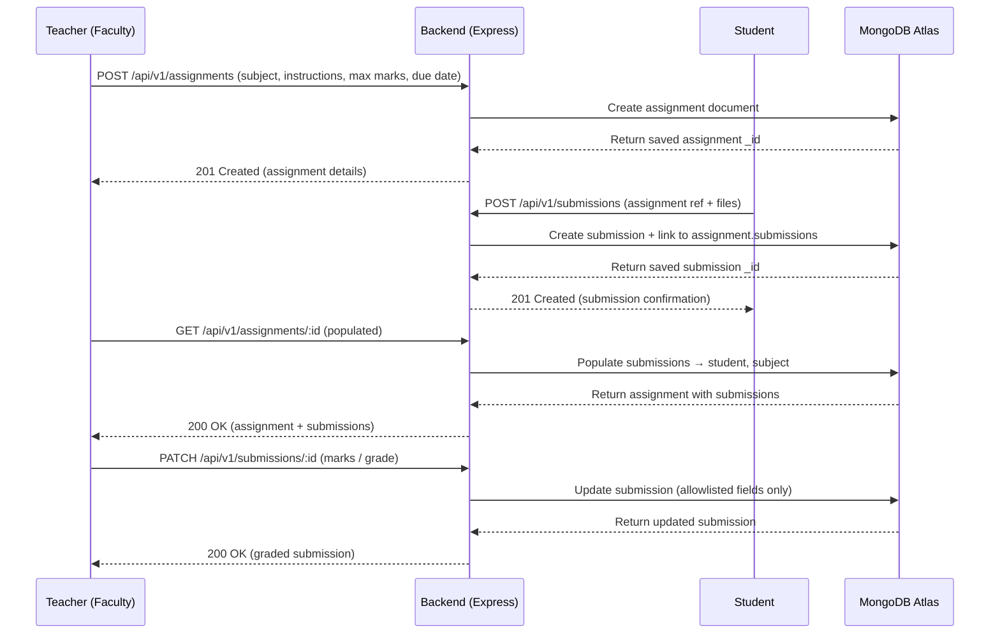
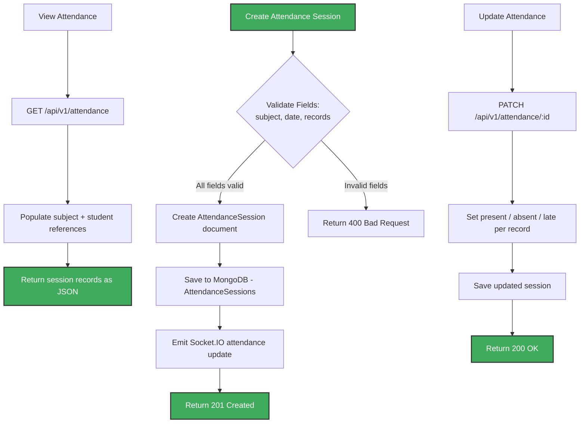
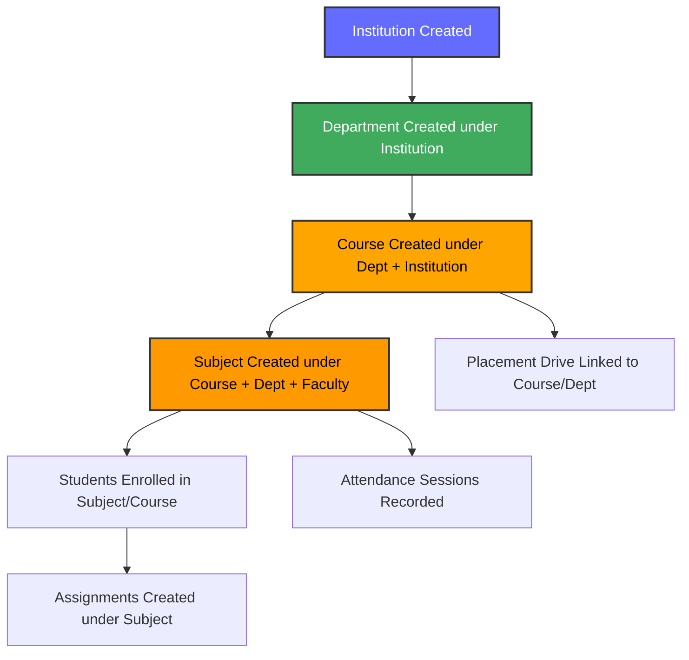
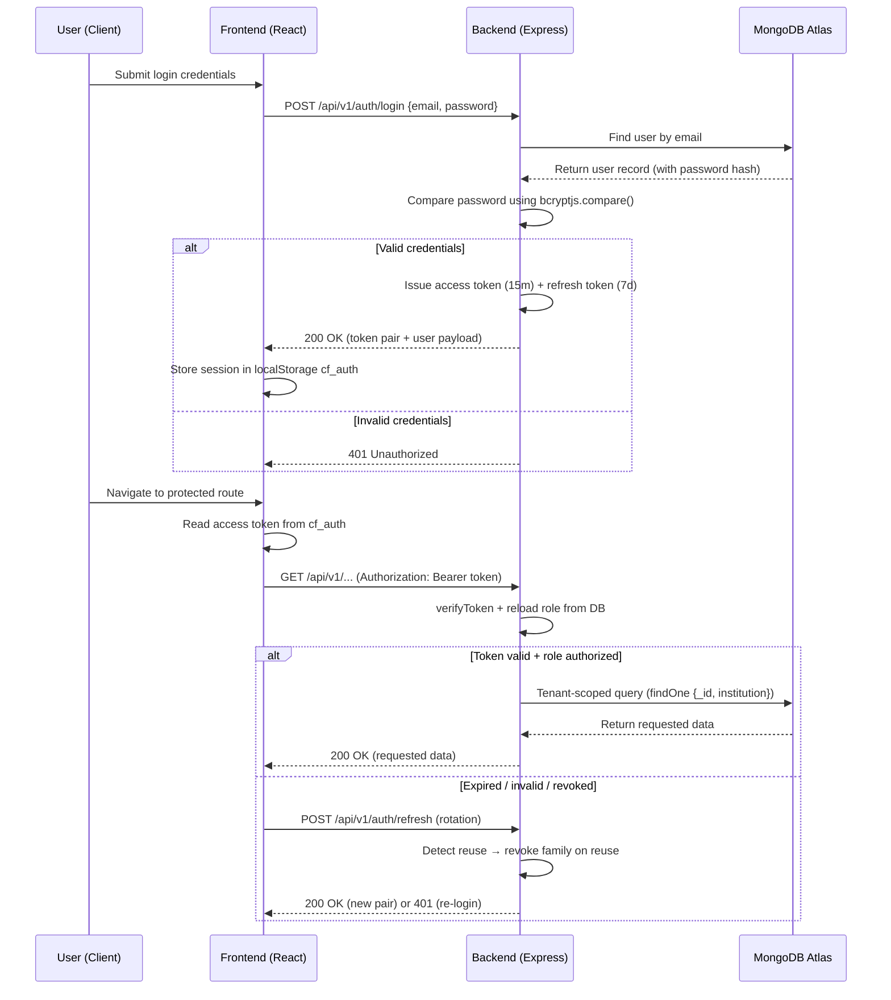
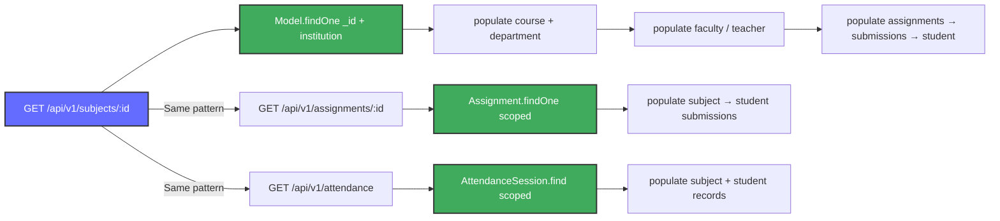
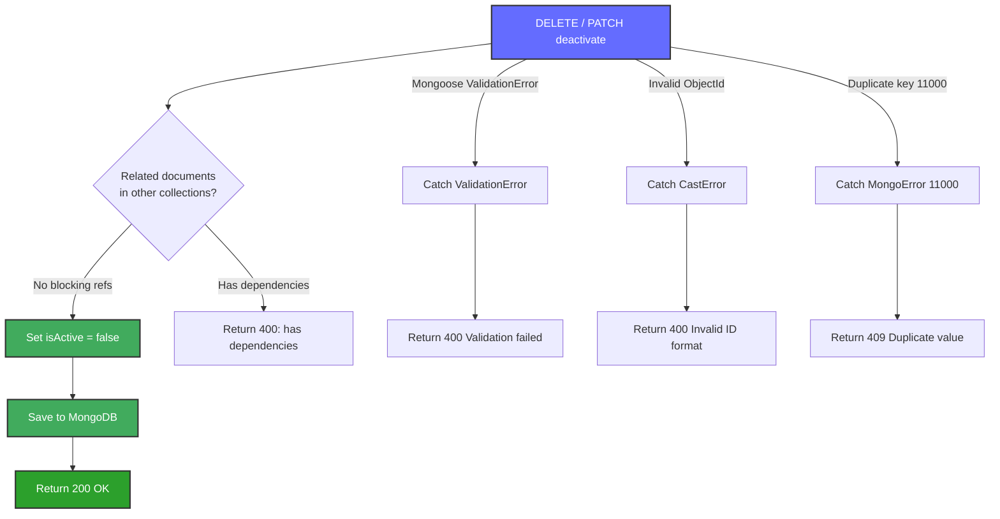

# CampusFlow — Smart College Management Platform

**CampusFlow** is a full-stack, multi-tenant campus management platform built with **React 19 + Vite** (frontend) and **Express 4 + Mongoose 8 + MongoDB** (backend). It provides an integrated system for managing institutions, users, departments, courses, subjects, enrollments, assignments, submissions, attendance sessions, announcements, events, companies, placement drives, job applications, requests/leave, notifications, study resources, AI reports, search, and analytics.

Five roles: **super admin, college admin (institution admin), faculty, student, placement officer**. Tenant isolation is enforced on every object route; roles are re-checked from the database per request.

---

## Table of Contents

1. [Architecture Overview](#architecture-overview)
2. [System Flowcharts](#system-flowcharts)
   - 1. [Overall Request Flow](#1-overall-request-flow)
   - 2. [User Registration & Authentication Flow](#2-user-registration--authentication-flow)
   - 3. [Assignment & Submission Flow](#3-assignment--submission-flow)
   - 4. [Attendance Flow](#4-attendance-flow)
   - 5. [Placement Drive Flow](#5-placement-drive-flow)
   - 6. [Subject & Course Management Flow](#6-subject--course-management-flow)
   - 7. [Request/Leave Management Flow](#7-requestleave-management-flow)
   - 8. [JWT Authentication & Authorization Flow](#8-jwt-authentication--authorization-flow)
   - 9. [Mongoose Populate & Cross-Collection Query Flow](#9-mongoose-populate--cross-collection-query-flow)
   - 10. [Soft Delete & Error Handling Flow](#10-soft-delete--error-handling-flow)
3. [Folder Structure](#folder-structure)
4. [Technology Stack](#technology-stack)
5. [Backend — Modules & APIs](#backend--modules--apis)
6. [Frontend — Structure & Working](#frontend--structure--working)
7. [Setup & Installation](#setup--installation)
8. [Demo Credentials](#demo-credentials)
8. [API Endpoint Reference](#api-endpoint-reference)
9. [Rate Limiting](#rate-limiting)
10. [Key Relationships Between Models](#key-relationships-between-models)
11. [Testing & CI](#testing--ci)
12. [Deployment](#deployment)
13. [Security Model](#security-model)
14. [Notes](#notes)

---

## Architecture Overview

### Component Layer Diagram

```
┌─────────────────────────────────────────────────────────────────────────┐
│                              CLIENT LAYER                                │
├─────────────────────────────────────────────────────────────────────────┤
│  Browser ──► Vite dev server / Vercel dist ──► React 19 + Router 8      │
│  (Zustand auth store `cf_auth`, Axios interceptor, Socket.IO client,    │
│   Tailwind 4, Motion.dev, Recharts, lazy Three.js, PWA)                 │
│                              (HTTPS / WSS)                              │
├─────────────────────────────────────────────────────────────────────────┤
│                              SERVER LAYER (Render)                       │
├─────────────────────────────────────────────────────────────────────────┤
│  Express 4 ──► Helmet + CORS + mongo-sanitize + rejectUnsafePayload     │
│      ──► credential rate limiters ──► /api/v1 router (APIs/index.js)    │
│      ──► verifyToken + role checks ──► controllers/ ──► services/       │
│      ──► Socket.IO realtime (notifications/announcements/attendance)    │
│      ──► node-cron weekly digest ──► Multer → local disk / Cloudinary   │
│                              (Mongoose 8 ODM)                           │
├─────────────────────────────────────────────────────────────────────────┤
│                             DATABASE LAYER (Atlas)                       │
├─────────────────────────────────────────────────────────────────────────┤
│  Users · Institutions · Departments · Courses · Subjects · Enrollments  │
│  Assignments · Submissions · AttendanceSessions · Announcements          │
│  Events · Companies · JobDrives · JobApplications · Requests             │
│  Notifications · AIReports · LearningResources · RefreshTokens           │
│  ActivityLogs                                                            │
└─────────────────────────────────────────────────────────────────────────┘
```

### Architecture Flow

```mermaid
graph LR
    Browser[Client Browser] -->|HTTPS| Frontend[React + Vite Frontend]
    Frontend -->|REST /api/v1 + JWT| Express[Express Server]
    Express -->|Route Handler| Routes[API Routers]
    Routes -->|Controller + Service| Models[Mongoose Models]
    Models -->|Query| DB[(MongoDB Atlas)]
    DB -->|Data| Models
    Models -->|JSON| Routes
    Routes -->|JSON| Express
    Express -->|JSON| Frontend
    Frontend -->|Rendered UI| Browser
    Express <-->|WSS realtime| Frontend

    style Frontend fill:#646cff,stroke:#333,stroke-width:2px,color:#fff
    style Express fill:#41ab5d,stroke:#333,stroke-width:2px,color:#fff
    style Models fill:#ff9900,stroke:#333,stroke-width:2px,color:#fff
    style Browser fill:#e74c3c,stroke:#333,stroke-width:2px,color:#fff
```



### Multi-Layer Architecture Summary

| **Layer** | **Technology** | **Responsibilities** |
|-----------|----------------|-----------------------|
| **Presentation** | React 19 + Vite 8, Tailwind 4, Zustand | Renders UI, client routing, auth session (`cf_auth`), realtime updates |
| **API** | Express 4 (`backend/app.js`, `backend/APIs/`) | JSON parsing, CORS, Helmet, sanitization, per-endpoint rate limits, error handling |
| **Business Logic** | `controllers/` + `services/` + `middlewares/verifyToken.js` | Tenant scoping (`utils/scope.js`), allowlisted writes (`utils/sanitize.js`), workflow transitions |
| **Data Access** | Mongoose 8 (`models/`) | Schemas, validation, population, indexes |
| **Database** | MongoDB Atlas (local URI for dev) | Persistence, indexing, aggregation |
| **Realtime** | Socket.IO server + client | Notifications, announcements, attendance, request updates |
| **Files/Email/AI** | Multer + Cloudinary, Nodemailer SMTP, OpenAI (optional) | Uploads, digests + password-reset mail, AI reports with graceful fallback |

---

## System Flowcharts

### 1. Overall Request Flow

```mermaid
flowchart LR
    UserBrowser[User Browser] -->|HTTPS| Frontend[React Frontend]
    Frontend -->|REST /api/v1 + Bearer token| ExpressServer[Express Backend]
    ExpressServer -->|verifyToken + role check| RouteHandler[Router → Controller]
    RouteHandler -->|Tenant-scoped query| MongooseModel[Mongoose Model]
    MongooseModel -->|MongoDB Query| MongoDBAtlas[(MongoDB Atlas)]
    MongoDBAtlas -->|Data Response| MongooseModel
    MongooseModel -->|Serialized JSON| RouteHandler
    RouteHandler -->|JSON Response| ExpressServer
    ExpressServer -->|JSON / WSS event| Frontend
    Frontend -->|Rendered UI| UserBrowser

    style UserBrowser fill:#e74c3c,stroke:#333,stroke-width:2px,color:#fff
    style Frontend fill:#646cff,stroke:#333,stroke-width:2px,color:#fff
    style ExpressServer fill:#41ab5d,stroke:#333,stroke-width:2px,color:#fff
    style RouteHandler fill:#ffa500,stroke:#333,stroke-width:2px,color:#000
    style MongooseModel fill:#ff9900,stroke:#333,stroke-width:2px,color:#000
    style MongoDBAtlas fill:#47a241,stroke:#333,stroke-width:2px,color:#fff
```



### 2. User Registration & Authentication Flow



### 3. Assignment & Submission Flow



### 4. Attendance Flow



### 5. Placement Drive Flow

```mermaid
flowchart LR
    CompanyRegistered[Company Registered by Placement Officer] --> CollegeValidated{Institution + eligibility validated}
    CollegeValidated -->|Valid| CreateDrive[Create JobDrive Record]
    CreateDrive --> SetEligibility[Set eligibility: min CGPA, backlogs, branches]
    SetEligibility --> DefineStages[Define stages: Application → Aptitude → Technical → HR]
    DefineStages --> AppWindowOpen[Application Window Opens]
    AppWindowOpen --> StudentsApply[Students Apply → JobApplication]
    StudentsApply --> StageProgress{Stage Evaluation}
    StageProgress -->|Pass| NextStage[Advance to Next Stage]
    StageProgress -->|Fail| Rejected[Application Marked Rejected]
    NextStage -->|Pass All Stages| Placed[Student Placed ]

    style CompanyRegistered fill:#646cff,stroke:#333,stroke-width:2px,color:#fff
    style CollegeValidated fill:#ffa500,stroke:#333,stroke-width:2px,color:#000
    style CreateDrive fill:#41ab5d,stroke:#333,stroke-width:2px,color:#fff
    style Placed fill:#2ca02c,stroke:#333,stroke-width:2px,color:#fff
```



### 6. Subject & Course Management Flow



### 7. Request/Leave Management Flow

```mermaid
stateDiagram-v2
    [*] --> Submitted: User submits request
    Submitted --> UnderReview: Reviewer picks up
    UnderReview --> Approved: Request validated and approved
    UnderReview --> Rejected: Request invalid or denied
    Approved --> Escalated: Requires higher-level approval
    Rejected --> ReSubmitted: User revises and resubmits
    ReSubmitted --> UnderReview: Back to review
    Escalated --> FinalApproved: Final approval granted
    Escalated --> FinalRejected: Final rejection

    style Submitted fill:#646cff,stroke:#333,stroke-width:2px,color:#fff
    style Approved fill:#2ca02c,stroke:#333,stroke-width:2px,color:#fff
    style Rejected fill:#d62728,stroke:#333,stroke-width:2px,color:#fff

    Note over Submitted,Escalated: Server-enforced transitions; realtime update on change
```

### 8. JWT Authentication & Authorization Flow



### 9. Mongoose Populate & Cross-Collection Query Flow



### 10. Soft Delete & Error Handling Flow



---

## Folder Structure

```
CampusFlow/
├── backend/                         # Express + Mongoose API
│   ├── server.js                    # Entrypoint: DB → Socket.IO → HTTP listen
│   ├── app.js                       # App wiring: security, CORS, /api/v1, errors
│   ├── package.json
│   ├── .env.example
│   ├── APIs/                        # Route definitions (mounted in APIs/index.js)
│   │   ├── index.js               # Aggregates all routers under /api/v1
│   │   ├── authAPI.js             # login/register/refresh/forgot/reset
│   │   ├── userAPI.js             # user CRUD + bulk import
│   │   ├── institutionAPI.js      # institutions (tenants)
│   │   ├── departmentAPI.js
│   │   ├── courseAPI.js
│   │   ├── subjectAPI.js
│   │   ├── enrollmentAPI.js
│   │   ├── assignmentAPI.js
│   │   ├── submissionAPI.js
│   │   ├── attendanceAPI.js       # attendance sessions
│   │   ├── announcementAPI.js
│   │   ├── eventAPI.js
│   │   ├── companyAPI.js
│   │   ├── jobDriveAPI.js
│   │   ├── jobApplicationAPI.js
│   │   ├── requestAPI.js
│   │   ├── notificationAPI.js
│   │   ├── analyticsAPI.js
│   │   ├── searchAPI.js
│   │   ├── studyAPI.js            # study resources + syllabus ingest
│   │   └── aiReportAPI.js
│   ├── controllers/                 # Request handlers per resource
│   ├── services/                    # email, digest cron, AI, ingestion
│   ├── models/                      # Mongoose schemas (20 models)
│   │   ├── UserModel.js · InstitutionModel.js · DepartmentModel.js
│   │   ├── CourseModel.js · SubjectModel.js · EnrollmentModel.js
│   │   ├── AssignmentModel.js · SubmissionModel.js
│   │   ├── AttendanceSessionModel.js · AnnouncementModel.js
│   │   ├── EventModel.js · CompanyModel.js · JobDriveModel.js
│   │   ├── JobApplicationModel.js · RequestModel.js
│   │   ├── NotificationModel.js · AIReportModel.js
│   │   ├── LearningResourceModel.js · RefreshTokenModel.js
│   │   └── ActivityLogModel.js
│   ├── middlewares/                 # verifyToken, validate, auditLog, errorHandler
│   ├── config/                      # env, db, security, multer, socket
│   ├── utils/                       # scope, sanitize, token, asyncHandler, logger…
│   ├── seed/                        # seed.js demo data (DROPS data first)
│   ├── scripts/                     # smoke.mjs, provisionIndexes.js, check-syntax
│   ├── tests/                       # jest + supertest, 19 suites
│   └── uploads/                     # Local upload fallback (gitignored content)
├── frontend/                        # React 19 + Vite 8
│   ├── package.json · vite.config.js · vercel.json · index.html
│   ├── .env.example                 # VITE_API_URL (must end in /api/v1)
│   ├── public/
│   └── src/
│       ├── main.jsx               # Entry: router + providers + PWA
│       ├── App.jsx
│       ├── api/axios.js           # Base client + refresh interceptor
│       ├── store/                 # useAuth (cf_auth), useSocket
│       ├── shell/ · components/   # layout, landing, campus, hero, ui, visual
│       ├── pages/
│       │   ├── Landing.jsx · Dashboard.jsx · Directory.jsx
│       │   ├── Events.jsx · Study.jsx · Profile.jsx · NotFound.jsx
│       │   ├── auth/            # Login, Onboarding, PasswordReset
│       │   ├── dashboards/      # Admin/Faculty/Student/Placement homes
│       │   ├── academic/        # Subjects, Assignments, Attendance, Enrollments
│       │   ├── admin/           # Institutions, Users, Departments, Courses, AIReports
│       │   ├── placement/       # Placement drives + applications
│       │   └── requests/        # Requests / leave workflow
│       ├── config/ · utils/ · system/ · styles/ · assets/
├── .github/workflows/ci.yml
├── DEPLOYMENT.md
└── README.md
```

---

## Technology Stack

### Frontend (`frontend/package.json`)

| Technology | Version | Purpose |
|---|---|---|
| **React + React DOM** | ^19.2.8 | UI library |
| **Vite** | ^8.3.0 | Build tool & dev server |
| **react-router** | ^8.4.0 | Client routing |
| **zustand** | ^5.0.15 | Auth + socket stores |
| **axios** | ^1.20.0 | API client with refresh interceptor |
| **socket.io-client** | ^4.8.3 | Realtime updates |
| **Tailwind CSS** | ^4.3.3 | Styling (+ `@tailwindcss/vite`) |
| **motion** | ^13.4.0 | Animations |
| **recharts** | ^3.10.1 | Dashboards / analytics charts |
| **react-hook-form** | ^7.88.0 | Forms |
| **react-hot-toast** | ^2.6.1 | Toasts |
| **lucide-react** | ^1.47.0 | Icons |
| **@radix-ui/react-dialog** | ^1.1.23 | Accessible dialogs |
| **three + @react-three/fiber** | lazy 3D | Hero / visual scenes (code-split) |
| **vite-plugin-pwa** | ^1.3.0 | PWA support |

### Backend (`backend/package.json`)

| Technology | Version | Purpose |
|---|---|---|
| **Express** | ^4.19.2 | Web framework |
| **Mongoose** | ^8.4.0 | MongoDB ODM |
| **jsonwebtoken** | ^9.0.2 | Access + refresh tokens |
| **bcryptjs** | ^2.4.3 | Password hashing |
| **helmet / cors / express-mongo-sanitize / express-rate-limit** | ^7.x / ^2.8.5 / ^2.2.0 / ^7.2.0 | Security + abuse protection |
| **express-validator** | ^7.0.1 | Request validation |
| **multer → cloudinary** | ^1.4.5 / ^2.2.0 | Uploads (local fallback vs CDN) |
| **socket.io** | ^4.8.3 | Realtime events |
| **nodemailer + node-cron** | ^7.0.13 / ^4.6.0 | Email + weekly digest job |
| **openai** | ^4.47.0 | AI reports (optional, graceful fallback) |
| **ics / json2csv / pdf-parse** | misc | Calendar export, CSV export, syllabus ingest |
| **winston** | ^3.13.0 | Logging |
| **jest + supertest + mongodb-memory-server** | dev | 19 test suites |

---

## Backend — Modules & APIs

### Server Configuration

- **Entrypoint**: `backend/server.js` — connects MongoDB, attaches Socket.IO, starts cron digest, listens on `PORT` (default `5000`).
- **App wiring**: `backend/app.js` — `trust proxy`, Helmet, CORS (`CLIENT_URL` allowlist), 1 MB JSON cap, mongo-sanitize, unsafe-payload rejection, credential rate limiters, `/api/health`, `/api/v1` router, protected `/uploads/:filename`, 404 + centralized error handler.
- **Env**: `backend/config/env.js` requires `DB_URL` (or `MONGO_URI`) plus access + refresh JWT secrets — the server **refuses to boot** without them.

### Module Details

#### Auth (`models/UserModel.js` + `RefreshTokenModel.js`)
- Short-lived **access tokens (default 15m)** + DB-backed **rotating refresh tokens (default 7d)** with **reuse detection** (reuse revokes the whole family).
- Password hashing via **bcryptjs**; role re-loaded from DB per request, never trusted from the JWT claim. Deactivated / post-password-change sessions rejected.
- Endpoints: register, login, refresh, logout, forgot-password, reset-password, change-password.

#### Users (`models/UserModel.js`)
- Role-based (`super_admin`, `college_admin`/`institution admin`, `faculty`, `student`, `placement_officer`), institution-scoped, `isActive` soft delete, bulk import, avatar uploads.

#### Institutions (`models/InstitutionModel.js`)
- Tenants of the system. Every object route is scoped with `findOne({ _id, institution })` via `utils/scope.js`.

#### Departments /  Courses /  Subjects /  Enrollments
- `DepartmentModel` → institution; `CourseModel` → institution + department; `SubjectModel` → course + department + faculty; `EnrollmentModel` links students to courses/subjects. Syllabus PDF ingest feeds `LearningResourceModel`.

#### Assignments /  Submissions
- `AssignmentModel` (subject, instructions, max marks, due date, `submissions[]`); `SubmissionModel` (student, files, marks, grade). Creation auto-links submission → assignment; grading uses allowlisted fields.

#### Attendance (`models/AttendanceSessionModel.js`)
- Session-based records per subject + date with per-student `present/absent/late` entries; realtime Socket.IO broadcast on change.

#### Announcements /  Events /  Notifications
- Targeted by institution/department/course; pinned + priority announcements; realtime notification delivery with preferences; weekly email digest (no-op without SMTP).

#### Companies /  Placement Drives /  Job Applications
- `CompanyModel` (recruiting toggle) → `JobDriveModel` (eligibility, stages, window, status) → `JobApplicationModel` (stage progression to placed/rejected). Eligibility checks (CGPA/backlogs/branch) enforced server-side.

#### Requests (`models/RequestModel.js`)
- Categories: leave, document, fee, course-drop, subject-change, extension, grievance, other. Server-enforced status transitions with audit log.

#### Analytics /  Search /  Study /  AI Reports
- Aggregated dashboards (Recharts frontend), global tenant-scoped search, learning resources + syllabus ingest, OpenAI reports that degrade to snapshot summaries without a key.

---

## Frontend — Structure & Working

### Entry Point (`src/main.jsx` / `src/App.jsx`)
- Router + auth provider + PWA registration; `App.jsx` composes shell/layout, landing, dashboards, and protected routes.

### Data + Session (`src/api/axios.js`, `src/store/`)
- Axios base URL from `VITE_API_URL` (must end with `/api/v1`); interceptor silently refreshes expired access tokens.
- `useAuth` persists `{ user, accessToken, refreshToken }` to `localStorage` under **`cf_auth`**; `useSocket` manages the realtime connection. Logout clears `cf_auth` and revokes the refresh token server-side.

### Pages
- **Landing / Dashboard / Directory / Events / Study / Profile** — public + shared surfaces.
- **auth/** — Login, Onboarding, PasswordReset.
- **dashboards/** — AdminHome, FacultyHome, StudentHome, PlacementHome (role-specific).
- **academic/** — Subjects, Assignments, Attendance, MyEnrollments.
- **admin/** — Institutions, Users, Departments, Courses, AIReports.
- **placement/** — Drives + applications pipeline.
- **requests/** — Request/leave submission + status tracking.

### Styling / UX
- Tailwind 4 + custom styles, Motion.dev animations, Radix dialogs, Lucide icons, Recharts dashboards, code-split Three.js hero/visuals, `react-hot-toast` feedback, PWA manifest.

### Vite Configuration (`vite.config.js`)
React plugin + Tailwind plugin + PWA; `vercel.json` adds the SPA fallback so non-`api/` routes resolve to `index.html`.

---

## Setup & Installation

### Prerequisites
- **Node.js 20+**, **MongoDB** (local URI for dev, Atlas for prod), **npm**.

### 1. Backend Setup
```bash
cd backend
cp .env.example .env   # fill DB_URL + SECRET_KEY + SECRET_KEY_REFRESH (see below)
npm install
npm run seed           # demo data — DROPS existing data first; never run in prod
npm run dev            # http://localhost:5000/api/health
```

Seed logins: see [Demo Credentials](#demo-credentials) below.

### 2. Frontend Setup
```bash
cd frontend
cp .env.example .env   # VITE_API_URL=http://localhost:5000/api/v1
npm install
npm run dev            # http://localhost:5173
```

### 3. Verify
- Backend: `GET http://localhost:5000/api/health` → `{"status":"ok"}`
- Frontend: `http://localhost:5173` — login and spot-check dashboard, assignments, placement, requests.
- `.env` files are gitignored and must never be committed.

### Environment

Backend (`backend/.env`): `PORT` (default 5000), `DB_URL` (or legacy `MONGO_URI`), `SECRET_KEY`, `SECRET_KEY_REFRESH` (`openssl rand -hex 32`), `CLIENT_URL` (comma-separated origins), `ACCESS_TOKEN_EXPIRES` (default `15m`), `REFRESH_TOKEN_EXPIRES_DAYS` (default `7`), optional `SMTP_*`, `EMAIL_FROM`, `OPENAI_API_KEY` / `OPENAI_MODEL`, `UPLOAD_DIR`, `MAX_FILE_MB`, `UPLOAD_DRIVER` (`local`|`cloudinary`), `CLOUDINARY_*`.

Frontend (`frontend/.env`): `VITE_API_URL` — must include the `/api/v1` suffix.

---

## Demo Credentials

Seeded demo accounts created by `backend/seed/seed.js` (the seed script drops all collections first — never run against production). No super admin credential is published here.

| Role | Email | Password |
|---|---|---|
| College admin | `admin@anurag.edu.in` | `Admin@123` |
| Placement officer | `placement@anurag.edu.in` | `Admin@123` |
| HOD | `hod.cse@anurag.edu.in` | `Faculty@123` |
| Faculty | `faculty1@anurag.edu.in` | `Faculty@123` |
| Student | `student1@anurag.edu.in` | `Student@123` |

---

## API Endpoint Reference

Base path: **`/api/v1`**. All object routes are tenant-scoped; most require a Bearer access token with role authorization.

### Auth (`/auth`)
| Method | Endpoint | Description |
|--------|----------|-------------|
| POST | `/auth/register` | Register new user (rate-limited) |
| POST | `/auth/login` | Login, returns access + refresh pair |
| POST | `/auth/refresh` | Rotate refresh token (reuse-detected) |
| POST | `/auth/logout` | Revoke refresh token, clear session |
| POST | `/auth/forgot-password` | Request password reset |
| POST | `/auth/reset-password` | Reset with token |
| POST | `/auth/change-password` | Change with current-password verification |

### Users (`/users`)
| Method | Endpoint | Description |
|--------|----------|-------------|
| GET | `/users` | List users (tenant-scoped, paginated) |
| GET | `/users/:id` | Get user by ID |
| PATCH | `/users/:id` | Update allowlisted fields |
| PATCH | `/users/:id/deactivate` | Soft-deactivate (`isActive: false`) |
| POST | `/users/bulk` | Bulk import users |

### Institutions (`/institutions`) · Departments (`/departments`) · Courses (`/courses`) · Subjects (`/subjects`) · Enrollments (`/enrollments`)
Full CRUD (`GET` list, `GET /:id` populated, `POST`, `PATCH /:id`, `DELETE /:id` where applicable), all tenant-scoped. Subjects populate course/department/faculty; enrollments link students to courses/subjects.

### Assignments (`/assignments`) · Submissions (`/submissions`)
| Method | Endpoint | Description |
|--------|----------|-------------|
| POST | `/assignments` | Faculty creates assignment |
| GET | `/assignments` · `/:id` | List / populated detail (submissions → student) |
| PATCH/DELETE | `/assignments/:id` | Update / remove |
| POST | `/submissions` | Student submits (auto-links to assignment) |
| GET | `/submissions` · `/:id` | List / populated detail |
| PATCH | `/submissions/:id` | Grade (marks/grade, allowlisted) |
| DELETE | `/submissions/:id` | Remove + unlink from assignment |

### Attendance (`/attendance`)
| Method | Endpoint | Description |
|--------|----------|-------------|
| POST | `/attendance` | Create attendance session |
| GET | `/attendance` · `/:id` | List / detail with populated refs |
| PATCH | `/attendance/:id` | Update session / record statuses |
| DELETE | `/attendance/:id` | Delete session |

### Announcements (`/announcements`) · Events (`/events`) · Notifications (`/notifications`)
Full CRUD + extras: pin toggle for announcements, category/date windows for events, preferences + read-state + realtime delivery for notifications.

### Companies (`/companies`) · Job Drives (`/job-drives`) · Job Applications (`/job-applications`)
| Method | Endpoint | Description |
|--------|----------|-------------|
| POST/GET/PATCH/DELETE | `/companies…` | Register/list/update/delete, recruiting toggle |
| POST/GET/PATCH/DELETE | `/job-drives…` | Create/list/update/delete, status transitions |
| POST/GET/PATCH | `/job-applications…` | Apply, list, stage progression (placed/rejected) |

### Requests (`/requests`)
| Method | Endpoint | Description |
|--------|----------|-------------|
| POST | `/requests` | Submit request/leave |
| GET | `/requests` · `/:id` | List (populated user) / detail |
| GET | `/requests/user/:userId` | Requests for one user |
| PATCH | `/requests/:id` | Update details |
| PATCH | `/requests/:id/status` | Server-enforced workflow transition |
| DELETE | `/requests/:id` | Delete request |

### Analytics (`/analytics`) · Search (`/search`) · Study (`/study`) · AI Reports (`/ai-reports`)
Aggregated dashboard stats, tenant-scoped global search, learning resources + syllabus ingest, AI-generated reports (placeholder snapshot without `OPENAI_API_KEY`).

Health: `GET /api/health` → `{"status":"ok","uptime":…}` (unversioned).

---

## Rate Limiting

Credential endpoints use **dedicated `express-rate-limit` instances** (`backend/app.js`) so one endpoint's traffic never starves another's budget:

- **10 requests / 15 minutes** per IP on each of: `/api/v1/auth/login`, `/auth/register`, `/auth/refresh`, `/auth/forgot-password`, `/auth/reset-password`
- Exceeding the budget returns throttled responses with `standardHeaders` (`RateLimit-*`); other API routes are not globally throttled.

```js
app.use('/api/v1/auth/login', credentialLimiter('Too many login attempts, please try again later'));
app.use('/api/v1', routes);
```

---

## Key Relationships Between Models

```
Institution (tenant root)
 ├── User (institution + role + isActive)
 ├── Department (institution)
 ├── Course (institution + department)
 ├── Subject (course + department + faculty)
 ├── Enrollment (student + course/subject)
 ├── Assignment (subject) → Submission (student + assignment)
 ├── AttendanceSession (subject + student records)
 ├── Announcement / Event / Notification (institution/dept/course targets)
 ├── Company (institution) → JobDrive → JobApplication (student)
 ├── Request (user)
 ├── LearningResource (subject/course)
 ├── RefreshToken (user + family, rotation + reuse detection)
 └── ActivityLog (audited writes)
```

---

## Testing & CI

```bash
cd backend && npm test        # jest + supertest + mongodb-memory-server (245 tests, 19 suites)
npm run check-syntax           # syntax gate used by CI
npm run smoke                  # post-deploy smoke script
cd frontend && npm run build   # production build check
```

CI (`.github/workflows/ci.yml`) runs on every push/PR to `main`: backend job (`npm ci` → `check-syntax` → `npm test`, `NODE_ENV=test`), frontend job (`npm ci` → `npm run build`, needs backend), lint job (`git diff --check`).

---

## Deployment

Production path: **MongoDB Atlas → Render (backend) → Vercel (frontend)**. Full guide: [DEPLOYMENT.md](DEPLOYMENT.md).

- **Render**: root `backend`, build `npm ci`, start `npm start`, health path `/api/health`. Required: `NODE_ENV=production`, `DB_URL`, `SECRET_KEY`, `SECRET_KEY_REFRESH`, `CLIENT_URL` (exact Vercel origin). Ephemeral disk → set `UPLOAD_DRIVER=cloudinary` + credentials in prod.
- **Vercel**: root `frontend`, preset Vite, build `npm run build`, output `dist`; `vercel.json` SPA fallback. Set `VITE_API_URL=https://<api>/api/v1`.
- Release checks: health endpoint, CORS allow/deny, Helmet headers, auth rate limits, Socket.IO, login + dashboard/assignments/placement/requests spot-check, upload persistence across redeploys, `npm test` green.

---

## Security Model

Tenant isolation on every object route (`findOne({ _id, institution })` via `utils/scope.js`); role re-checked from DB per request, never from the JWT claim; deactivated and post-password-change sessions rejected; refresh rotation with reuse detection (`RefreshTokenModel`); allowlisted writes (`utils/sanitize.js` + `academicScope.js`); server-enforced workflow transitions; per-endpoint credential rate limits; Helmet + CORS allowlist + `express-mongo-sanitize` + unsafe-payload rejection; protected upload serving (`controllers/filecontroller.js`); `http(s)`-only URL fields; audit logging (`middlewares/auditLog.js`). Adversarial coverage lives in `backend/tests/security*.test.js`.

---

## Notes

- Access tokens default to **15 minutes**, refresh tokens to **7 days** (configurable via `ACCESS_TOKEN_EXPIRES` / `REFRESH_TOKEN_EXPIRES_DAYS`).
- **Soft delete** (`isActive: false`) is used instead of hard deletion for users and key records.
- **Uploads**: local disk fallback for dev; Cloudinary CDN in production (Render disk is ephemeral).
- **Email/digest**: Nodemailer SMTP + weekly cron; password-reset and digest fall back to in-app notifications without SMTP.
- **AI reports**: require `OPENAI_API_KEY`; otherwise a snapshot summary is returned.
- Seed script **drops all collections first** — never run against production.
- Error middleware handles Mongoose `ValidationError`, `CastError`, and duplicate-key (`11000`) gracefully.

---

## License

ISC
